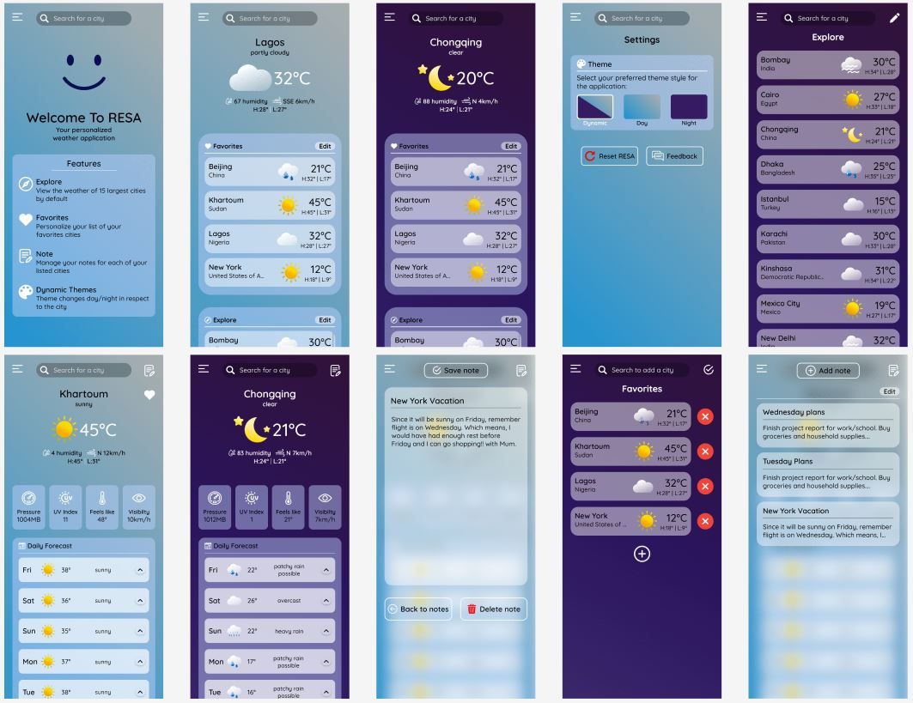
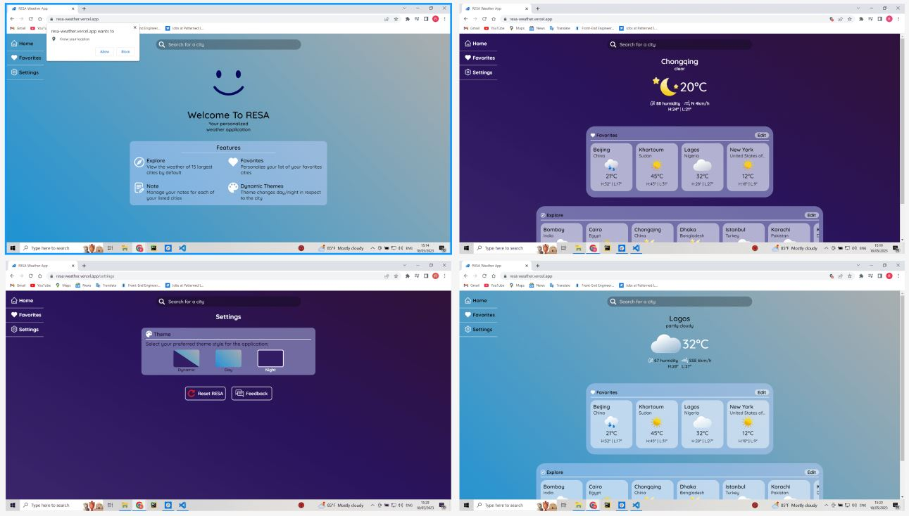
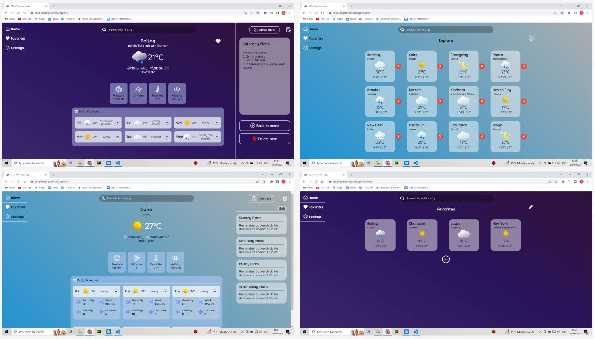

# Getting Started with RESA Weather App

RESA is a fully responsive versatile weather web-app companion that empowers users to explore diverse cities worldwide and effortlessly stay updated with their weather conditions. With RESA, users can add cities to a favorites list, ensuring quick access to the weather information that matters to them. Get start here: https://resa-weather.vercel.app

## Key Features
RESA is a feature-rich weather app companion that enhances your weather tracking experience with its customizable and intuitive features. Stay informed and plan your activities accordingly with the following key features:

1. **City Exploration**: Dive into weather conditions in cities worldwide. RESA provides a detailed page view for each city, including accurate 6-day forecasts, enabling you to make informed decisions.

2. **Explore List**: Discover the 15 largest cities in the world (by population) arranged alphabetically, along with their weather conditions. Customize this list to match your preferences and easily manage it according to your needs.

3. **Favorites List**: Create a personalized favorites list of frequently checked cities. This convenient feature ensures easy access to weather forecasts for your preferred locations. The favorites list takes priority over the explore list and is arranged alphabetically for quick reference.

4. **Notes Management**: Stay organized by adding, editing, and deleting notes for each city listed in your favorites or explore list. Keep important details and observations for individual locations, helping you plan your activities effectively.

5. **Dynamic Theming**: RESA offers dynamic theming based on the time of day for the city currently in view. By default, the application adjusts its theme accordingly. However, users have the option to manually set the theme to Day or Night or choose the dynamic theme setting from the app's settings page.

6. **Reset**: Clear up memory or restore RESA back to its default settings with ease. The reset option, accessible from the settings page, allows users to restore the app to its original state
 

## User Interface
The user interface (UI) of this RESA is designed to provide a visually appealing and intuitive experience for users. Here are some key aspects of the UI from both mobile and desktop views:

### Mobile views:
Below is a collaged screenshots of the different mobile views of the user interface of RESA:

Welcome page | Home page in light theme | Home page in dark theme | Settings page | Explore list
City page in light theme | City page in dark theme | New note | Favorites List | Notes management

### Desktop view:
Here are gouped collaged screenshots of the desktop views of the RESA user interface:

Welcome page | Home page in dark theme
Settings page | Home page in light theme

City page & new note | Explore list
City page & notes management | Favorites List

## Folder Structure
The folder structure of this RESA is designed to promote a clear separation of concerns and maintainability. Below is an overview of the major folders and their purposes:
* **`public/`**: This folder contains static files that are directly served by the web server.
  * `public/index.html`: The main HTML file that serves as the entry point of the application.
  * `public/ResaLogo.png`: The logo icon displayed in the browser tab or bookmark bar.

* **`screenshots/`**: This folder contains the screenshots of the app in both mobile and desktop view.

* **`src/`**: This folder contains the source code of the application.
  * `api/`: This folder contains all the api function calls and their constants.
    * `constants/`: This folder contains the api constants used across all api
  * `assets/`: This folder stores static assets such as images, animations and icons the application.
    * `animations/`: This contains all components and data for animations.
      * `data/`: This Folder stores the json data for the animations.
    * `icons/`: This folder contains all static icons for the application.
    * `images/`: This folder stores all the weather images.
  * `components/`: Contains reusable component folders (storing the components and their css respectively) used throughout the application.
  * `pages/`: Houses the individual pages of the app. Each page may have its own subfolder conataing the page and its css respectively.
  * `utilities/`: Includes utility functions or helper modules used across different parts of the application.
  * `App.jsx/`: The entry point of the application that renders the main component hierarchy.
  * `Context.js/`: Holds and manages the state logic across the application using the useContext API

## Available Scripts

In the project directory, you can run:

### `npm install`

This installs all the necessary dependencies on your system locally to run the app in developement mode. 

### `npm start`

Runs the app in the development mode.\
Open [http://localhost:3000](http://localhost:3000) to view it in your browser.

The page will reload when you make changes.\
You may also see any lint errors in the console.

### `npm test`

Launches the test runner in the interactive watch mode.\
See the section about [running tests](https://facebook.github.io/create-react-app/docs/running-tests) for more information.

### `npm run build`

Builds the app for production to the `build` folder.\
It correctly bundles React in production mode and optimizes the build for the best performance.

The build is minified and the filenames include the hashes.\
Your app is ready to be deployed!

See the section about [deployment](https://facebook.github.io/create-react-app/docs/deployment) for more information.

